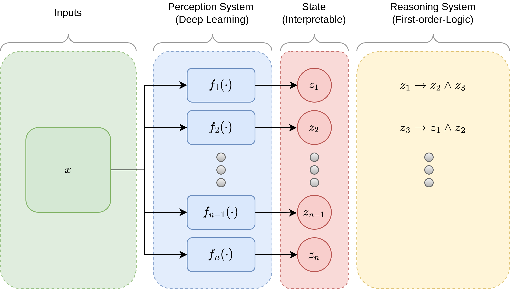

<div align="center">
<h1>Out-of-Distribution Detection <br>with Logical Reasoning</h1>



</div>


## Setup


```
conda install pytorch==1.12.0 torchvision==0.13.0 torchaudio==0.12.0 cudatoolkit=11.3 -c pytorch
pip install -U pytorch-ood
conda install pandas seaborn tqdm scikit-learn
```

### Prolog Inference Engine

To run the actual Prolog engine, you will have to install swi-prolog.

**Ubuntu**

```sh
sudo apt install swi-prolog
pip install -U pyswip==0.2.9
```

## Experiments

Results for experiments can be found in the corresponding subdirectories.
